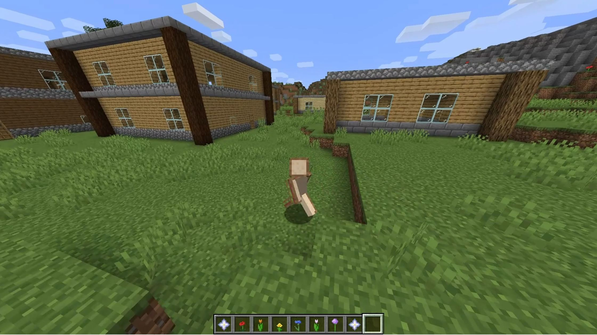
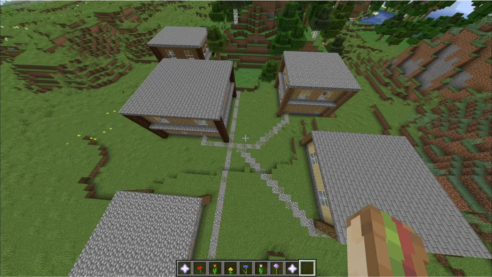
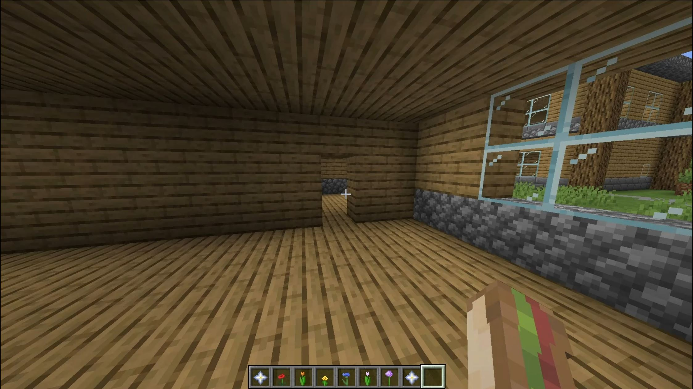

# Minecraft Village Generator

### Description

A python script that procedurally generates a village in Minecraft. Randomised house structures and connecting roads are created with each run of the script building different variations. 
This was a team project, the key features  that I implemented are listed below. 

### Key Features

#### Path Generation

I implemented a path generation algorithm to create a road that connects to the front door of each house. 

#### Room Creation

Created an algorithm that creates rooms in the village houses based on size and height of the structure. 
